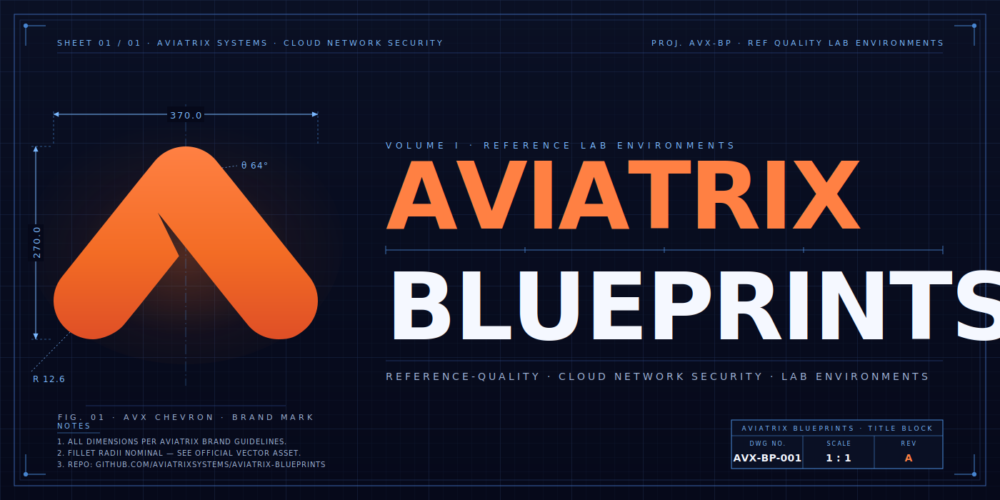

# Aviatrix Blueprints

Production-ready Terraform lab environments — Infrastructure as Code for learning, demonstrating, and testing the **Aviatrix Cloud Native Security Fabric**: Distributed Cloud Firewall, workload segmentation, and Zero Trust enforcement across AWS, Azure, and GCP.



> [!TIP]
> **🤖 Aviatrix Blueprints are Optimized for Claude Code**
>
> Get AI-assisted deployment with prerequisite checks, cost estimates, and automated orchestration.
>
> | Skill | Description |
> |-------|-------------|
> | `/deploy-blueprint` | Guided deployment with prerequisite validation |
> | `/analyze-blueprint` | Resource inventory and cost estimates |
> | `/validate-blueprint` | Pre-QA quality gate (Tier 1/2/3 checks) |
>
> [Get Claude Code](https://claude.ai/code)

## Quick Start with Claude Code

```bash
# Clone and open with Claude Code
git clone https://github.com/AviatrixSystems/aviatrix-blueprints.git
cd aviatrix-blueprints
claude
```

Inside Claude Code:
- `/deploy-blueprint aws-eks-multicluster` — Deploy with guided assistance
- `/analyze-blueprint aws-eks-multicluster` — Preview resources and costs before deploying
- `/validate-blueprint aws-eks-multicluster` — Run the pre-QA validation gate locally

## What are Blueprints?

Blueprints are **complete, deployable lab environments** that demonstrate Aviatrix capabilities in real-world scenarios. Unlike reusable Terraform modules, blueprints are designed to be:

- **Self-contained**: Everything needed to deploy a working environment
- **Educational**: Clear documentation explaining what's being built and why
- **Demonstrable**: Built-in test scenarios for showcasing functionality
- **Ephemeral**: Designed for temporary use with easy cleanup

## Blueprint Tiers

| Tier | Description | Requirements |
|------|-------------|--------------|
| **Verified** | Validated by Aviatrix QA team, tested against specific controller versions | Full QA and SE review, version compatibility matrix |
| **Community** | Contributed by the community, functional but not officially validated | Validated by an Aviatrix SE or Professional Services |

## Blueprint Catalog

| Blueprint | Description | Cloud(s) | Tier | Status |
|-----------|-------------|----------|------|--------|
| [aws-eks-multicluster](blueprints/aws-eks-multicluster/) | Multi-cluster EKS with Aviatrix transit and Distributed Cloud Firewall | AWS | Verified | ✅ Available |
| [azure-aks-multicluster](blueprints/azure-aks-multicluster/) | Multi-cluster AKS with Aviatrix transit and DCF (Cilium overlay, AppGW + NGINX two-tier ingress) | Azure | Community | ✅ Available |
| [prevent-lateral-movement-vm-tags](blueprints/prevent-lateral-movement-vm-tags/) | Zero Trust segmentation using DCF and VM tags to prevent lateral movement | AWS | Community | ✅ Available |
| [zero-trust-segmentation](blueprints/zero-trust-segmentation/) | Zero Trust workload segmentation with DCF SmartGroups | AWS | Community | ✅ Available |
| [k8s-cluster-aas](blueprints/k8s-cluster-aas/) | Pattern A — dedicated cluster per team (VPC-level isolation) | AWS, Azure, GCP | — | 🚧 Work in progress |
| [k8s-namespace-aas](blueprints/k8s-namespace-aas/) | Pattern B — single shared cluster, namespace per team (DCF + RBAC isolation) | AWS, Azure, GCP | — | 🚧 Work in progress |
| [k8s-prod-nonprod-hybrid](blueprints/k8s-prod-nonprod-hybrid/) | Pattern C — separate prod and nonprod clusters, namespace-as-a-service inside each | AWS, Azure, GCP | — | 🚧 Work in progress |
| [agentcore-aws](blueprints/agentcore-aws/) | AWS Bedrock AgentCore Runtime fronted by Aviatrix DCF | AWS | — | 🚧 Work in progress |

## Manual Deployment

### 1. Prerequisites

Before deploying any blueprint, ensure you have:

- An [Aviatrix Enterprise or Aviatrix Cloud Control Plane](docs/prerequisites/aviatrix-controller.md) deployed and accessible
- [Terraform](docs/prerequisites/terraform.md) installed (v1.5+)
- Cloud provider CLI configured for your target cloud:
  - [AWS CLI](docs/prerequisites/aws-cli.md)
  - [Azure CLI](docs/prerequisites/azure-cli.md)
  - [Google Cloud CLI](docs/prerequisites/gcloud-cli.md)
- Additional tools as required by specific blueprints (e.g., [kubectl](docs/prerequisites/kubectl.md))

See the [Prerequisites Overview](docs/prerequisites/README.md) for detailed setup instructions.

### 2. Deploy a Blueprint

```bash
# Clone the repository
git clone https://github.com/AviatrixSystems/aviatrix-blueprints.git
cd aviatrix-blueprints

# Navigate to your chosen blueprint
cd blueprints/aws-eks-multicluster

# Review the README for specific requirements
cat README.md

# Copy and configure variables
cp terraform.tfvars.example terraform.tfvars
# Edit terraform.tfvars with your values

# Deploy
terraform init
terraform plan
terraform apply
```

Multi-layer blueprints (the `k8s-*` patterns and the `*-multicluster` blueprints) document their per-layer deploy and destroy order in the blueprint's own `README.md`.

### 3. Explore and Learn

Each blueprint includes:
- Architecture diagrams
- Step-by-step deployment instructions
- Test scenarios to validate functionality
- Demo walkthroughs for presentations

### 4. Clean Up

```bash
# Destroy all resources when done
terraform destroy
```

## Repository Structure

```
aviatrix-blueprints/
├── docs/                    # Documentation and guides
│   ├── prerequisites/       # Setup guides for required tools
│   ├── getting-started.md   # Quick start guide
│   └── blueprint-standards.md
├── modules/                 # Shared Terraform modules
├── blueprints/              # Deployable lab environments
│   ├── _template/           # Template for new blueprints
│   ├── aws-eks-multicluster/
│   ├── azure-aks-multicluster/
│   ├── k8s-cluster-aas/         # Multi-cloud Pattern A
│   ├── k8s-namespace-aas/       # Multi-cloud Pattern B
│   ├── k8s-prod-nonprod-hybrid/ # Multi-cloud Pattern C
│   └── ...                  # Additional blueprints
└── .github/                 # CI/CD and templates
```

## Documentation

- [Getting Started Guide](docs/getting-started.md)
- [Blueprint Standards](docs/blueprint-standards.md)
- [Contributing Guide](CONTRIBUTING.md)
- [Prerequisites](docs/prerequisites/README.md)

## Contributing

We welcome contributions! Whether you're fixing a bug, improving documentation, or adding a new blueprint, please see our [Contributing Guide](CONTRIBUTING.md).

### Adding a New Blueprint

1. Copy the [blueprint template](blueprints/_template/)
2. Follow the [Blueprint Standards](docs/blueprint-standards.md)
3. Run `/validate-blueprint <name>` (or `.github/scripts/validate-blueprint.sh blueprints/<name>`) to confirm Tier 1/2 checks pass
4. Submit a PR for review

## Support

- **Issues**: [GitHub Issues](https://github.com/AviatrixSystems/aviatrix-blueprints/issues)
- **Discussions**: [GitHub Discussions](https://github.com/AviatrixSystems/aviatrix-blueprints/discussions)
- **Aviatrix Documentation**: [docs.aviatrix.com](https://docs.aviatrix.com)

## License

This project is licensed under the Apache License 2.0 - see the [LICENSE](LICENSE) file for details.
