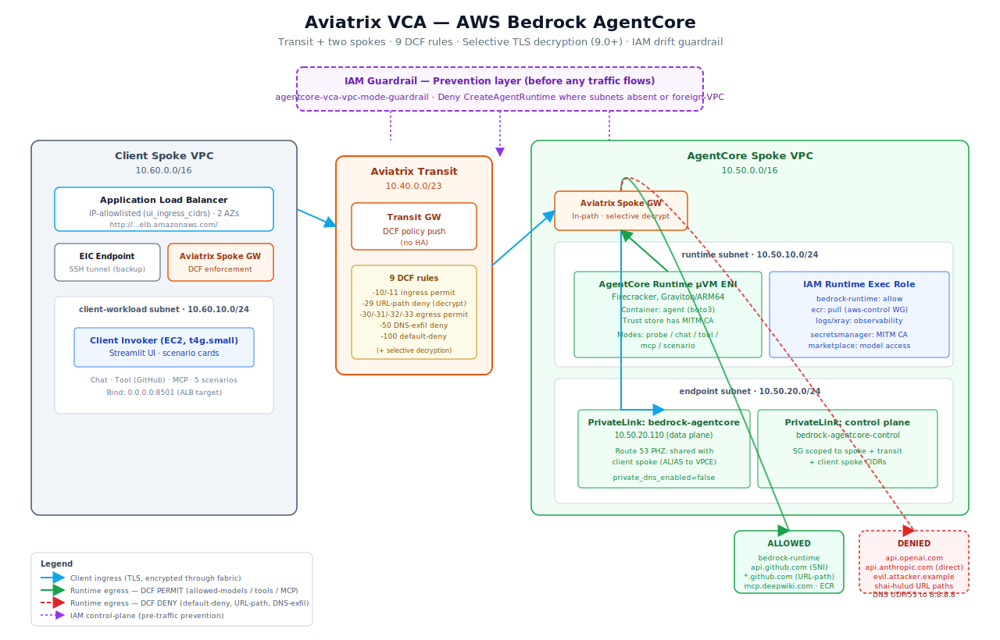

# agentcore-aws

Aviatrix Validated Containment Architecture blueprint for **AWS Bedrock AgentCore**. Deploys a transit + two spokes, places AgentCore Runtime ENIs in a customer VPC (VPC mode), fronts the AgentCore API with an in-path PrivateLink consumer endpoint, and enforces default-deny, domain-scoped egress via Aviatrix Distributed Cloud Firewall — with **selective TLS decryption + URL-path filtering** on the hosts where path-level granularity matters (Controller 9.0+).

See the sibling VCA spec at `Validated Containment Architectures/AWS Bedrock AgentCore/01-PRD.md` for the full design rationale and threat model. This blueprint ships the full scenario set plus an ALB-fronted demo UI; Browser / Code Interpreter / Gateway are deferred to v2.

## Architecture



- **Egress from Runtime ENIs** (10.50.10.0/24) routes through the AgentCore spoke gateway. DCF evaluates each flow against rules keyed on a subnet SmartGroup (source) and per-category WebGroups (destination) — allowed models, sanctioned tools, AWS control-plane, MCP servers. Default deny on anything else.
- **URL-path enforcement** via rule `-29-` on the `github_hosts` FQDN SmartGroup — selective TLS decryption (the spoke GW trusts the Aviatrix MITM CA) blocks supply-chain IoC paths like Shai-Hulud while letting legitimate GitHub paths through.
- **Ingress from client** (10.60.10.0/24) routes transit → AgentCore spoke GW → interface VPC endpoint. DCF evaluates with `src = client spoke` and `dst = PrivateLink endpoint FQDN SmartGroup` resolved via a shared Route 53 Private Hosted Zone.
- **IAM guardrail** (`vpc_mode_guardrail_policy_arn` output) denies `CreateAgentRuntime` / `CreateAgentRuntimeEndpoint` with `Null`-and-`ForAnyValue` conditions so operators cannot silently create runtimes in PUBLIC mode or with foreign subnets.
- **ALB-fronted UI** (IP-allowlisted) for browser access to the scenario cards; EC2 Instance Connect Endpoint + SSH tunnel as a backup path.

No HA on transit or spokes in v1. `single_ip_snat = false` on spokes because decryption on the spoke gateway is mutually exclusive with SNAT in Controller 9.0.10+; internet egress works via the transit's egress path.

## Prerequisites

| Tool | Version | Purpose |
|---|---|---|
| Terraform | >= 1.5 | Deploy the blueprint |
| AWS CLI | configured | ECR login, SSM, validation |
| Podman (or Docker) | machine running | Build the ARM64 agent container image |
| `jq` | any | Reads controller responses during validation |
| Aviatrix Controller | 8.1+ (FQDN SmartGroups GA) | DCF + SmartGroup support |
| AWS permissions | ECR, VPC, IAM, Route 53, EC2, SSM, `bedrock-agentcore-control:Create*` | Create all resources |

Region must be one of the AgentCore-supported set; defaults to `us-east-2` which has full PrivateLink coverage (data plane, control plane, gateway).

## Deploy

```bash
cd blueprints/agentcore-aws

# 1. Fetch the Aviatrix DCF MITM CA from your controller.
#    The repo ignores *.pem on purpose — regenerate locally from the
#    controller you'll deploy against. The runtime image's src-hash
#    references the PEM, so terraform init fails without it.
export AVIATRIX_CONTROLLER_IP=<your controller>
export AVIATRIX_USERNAME=admin
export AVIATRIX_PASSWORD='<aviatrix-admin-pw>'
./scripts/fetch-avx-ca.sh
# writes avx-root-ca.pem at the blueprint root + in agent/

# 2. Credentials for Terraform — TF_VAR_* env vars (keeps secrets out of tfvars).
export TF_VAR_controller_ip="${AVIATRIX_CONTROLLER_IP}"
export TF_VAR_controller_username="${AVIATRIX_USERNAME}"
export TF_VAR_controller_password="${AVIATRIX_PASSWORD}"
export TF_VAR_aviatrix_aws_account_name=AWS      # Aviatrix-onboarded account name

cp terraform.tfvars.example terraform.tfvars    # edit non-secret values as needed
# (or rely on defaults — everything else has a sensible default)

terraform init
terraform plan        # ~50 resources
terraform apply
```

Expected deploy time: ~25-30 minutes (transit + 2 spokes attach each take ~3-4 min; AgentCore Runtime create + container build+push ~4-5 min).

## Test

```bash
# Get the SSM one-liner from terraform output
terraform output -raw probe_command | bash
```

Expected probe results:

| Probe | ok= | DCF rule matched |
|---|---|---|
| 1. Bedrock InvokeModel (Claude 3 Haiku) | `true` | `-30-runtime-to-allowed-models` PERMIT |
| 2. HTTPS GET api.openai.com | `false` | `-100-runtime-default-deny` DENY |
| 3. HTTPS GET example-attacker.com | `false` | `-100-runtime-default-deny` DENY |
| 4. DNS TXT to 8.8.8.8 | `false` | `-50-runtime-dns-exfil-deny` DENY |

Verify in CoPilot:

1. **Topology** — transit + 2 spokes + DCF badge
2. **Security → Distributed Cloud Firewall → SmartGroups** — `runtime-subnet`, `agentcore-data-host`, `agentcore-control-host`, `client-spoke`, `any`
3. **Security → Distributed Cloud Firewall → WebGroups** — allowed-models, allowed-tools, aws-control-domains populated with their SNI filters
4. **FlowIQ → filter by src SmartGroup = `agentcore-vca-runtime-subnet`** — allowed Bedrock flows and denied internet flows both visible with human-readable rule names
5. **FlowIQ → filter action = denied** — entries for the three denied probes

## Resources created

| Resource | Count | Approx hourly cost | Notes |
|---|---|---|---|
| Aviatrix Transit Gateway | 1 (no HA) | $0.50 | `t3.medium` by default |
| Aviatrix Spoke Gateway (AgentCore) | 1 (no HA) | $0.25 | single_ip_snat true |
| Aviatrix Spoke Gateway (Client) | 1 (no HA) | $0.25 | single_ip_snat true |
| VPC + subnets (x2) | 2 | — | 10.50.0.0/16 + 10.60.0.0/16 |
| Interface VPC endpoint (bedrock-agentcore) | 1 | $0.01 × AZs | data plane |
| Interface VPC endpoint (bedrock-agentcore-control) | 1 | $0.01 × AZs | control plane |
| Route 53 Private Hosted Zones | 2 | $0.50/mo each | data + control hostnames |
| ECR repo | 1 | minimal | force_delete = true |
| AgentCore Runtime (idle) | 1 | $0 when no sessions | pay-per-CPU-second during sessions |
| Client invoker EC2 | 1 | ~$0.02 | `t4g.small` ARM64 |
| IAM policy (VPC-mode guardrail) | 1 | — | Attach to admin roles out-of-band |
| DCF SmartGroups | 5 | — | 1 subnet, 2 fqdn, 1 vpc, 1 cidr |
| DCF WebGroups | 3 | — | models, tools, aws-control |
| DCF policies | 7 | — | 3 permit + 2 ingress permit + 2 deny |

**Idle cost estimate: ~$1.10/hr ≈ $27/day**. AgentCore session invocations add per-CPU-second billing.

## Destroy

```bash
terraform destroy
```

The AgentCore Runtime terminates any active sessions; ECR force-delete handles the image; Aviatrix spoke/transit detach cleanly.

## Known limitations (v1)

- **No TLS decryption.** WebGroups match on SNI only. URL paths, methods, and bodies are invisible. This is a deliberate v1 choice (see PRD § TLS decryption feasibility).
- **No Browser / Code Interpreter / Gateway.** Toggles reserved for v2.
- **AgentCore → AgentCore data plane calls from the runtime are intra-VPC** and bypass DCF. Our threat model is egress to unapproved external destinations; internal PrivateLink hits from the agent are authorized by design.
- **Subnet-type SmartGroup requires Controller 8.1+.** FQDN SmartGroups require the same.
- **`hashicorp/aws` has no AgentCore resource** as of this blueprint; we use `awscc` (CloudFormation-registry-backed) for the Runtime. If AWS publishes a first-class provider resource later, migrate.

## Tested with

| Component | Version |
|---|---|
| Terraform | 1.14.x |
| aviatrix provider | 3.2.x |
| aws provider | 6.x |
| awscc provider | 1.80+ |
| Aviatrix Controller | 8.1+ |
