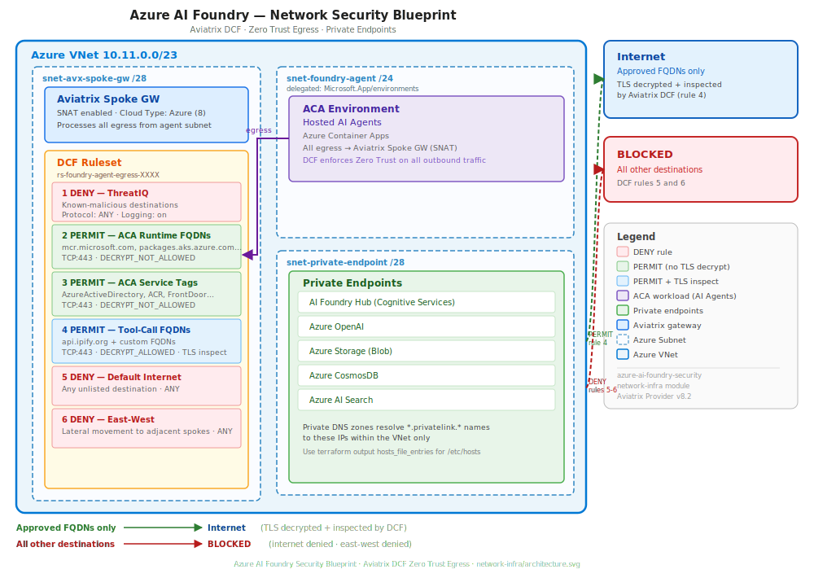

# Azure AI Foundry — Secure Hosted Agent Blueprint

> **Claude-optimized deployment:** This blueprint is designed to be deployed end-to-end by Claude Code. Claude can run every Terraform step, monitor provisioning, manage the agent lifecycle, and execute the DCF data-exfiltration demo without any manual intervention. Optionally, add the Aviatrix MCP server to let Claude query live DCF logs, inspect firewall rules, and run network diagnostics directly from the conversation. See the [Deploying with Claude Code](#deploying-with-claude-code) section below.

End-to-end Terraform blueprint for deploying a production-ready, network-isolated Azure AI Foundry agent environment secured by Aviatrix. Covers the full stack: Azure VNet with dedicated subnets, Aviatrix spoke gateway, Distributed Cloud Firewall (DCF) for Zero Trust agent egress, the complete Azure AI Foundry service stack with private endpoints, and an optional P2S VPN gateway for direct private access without a transit connection.

**DCF egress policy** permits only approved tool-call FQDNs and ACA runtime destinations, denying all other internet and east-west traffic. TLS decryption of agent tool-call traffic (`DECRYPT_ALLOWED` on rule 4) is supported but optional — enabling it requires a root CA configured in Aviatrix CoPilot and the certificate injected into the ACA agent container trust store. Without this step, deploy with `DECRYPT_NOT_ALLOWED` on rule 4.

## Modules

| Folder | Purpose | Required |
|--------|---------|----------|
| [`network-infra/`](network-infra/) | Azure VNet, subnets, Aviatrix spoke gateway, DCF ruleset | yes |
| [`foundry-playground/`](foundry-playground/) | Azure AI Foundry hub, project, private endpoints, supporting services | yes |
| [`vpn-access/`](vpn-access/) | Aviatrix P2S VPN gateway for private access to Foundry endpoints | optional |
| [`agent-deploy/`](agent-deploy/) | Builds and pushes the rogue-agent-sample container to ACR via ACR Tasks | optional |

**VPN access**: the `vpn-access` module is optional but strongly recommended for testing and validation if the Aviatrix spoke gateway deployed by `network-infra` is not yet connected to a transit gateway. Without a transit connection, there is no path from your local machine into the foundry VNet to reach the private endpoints directly. The VPN module provides that path without requiring any hub or transit setup — deploy it, connect, and you can immediately reach Foundry services privately for testing. If the spoke is already attached to a transit that extends to your network, the VPN is not needed.

## Architecture



The agent subnet is delegated to `Microsoft.App/environments` (ACA). All agent egress routes through the Aviatrix spoke gateway with SNAT. DCF rules enforce: deny ThreatIQ destinations → permit ACA runtime FQDNs (no decrypt) → permit ACA platform service tags (no decrypt) → permit approved tool-call FQDNs (TLS decrypted + inspected) → default deny internet → default deny east-west. Foundry services are reachable privately via private endpoints in the dedicated subnet, with private DNS zones resolving `privatelink.*` names within the VNet.

## Prerequisites

### Required Tools

| Tool | Min version | Used by | Install |
|------|-------------|---------|---------|
| [Terraform](https://developer.hashicorp.com/terraform/install) | 1.10+ | all modules | `brew install terraform` / package manager |
| [Azure CLI](https://learn.microsoft.com/en-us/cli/azure/install-azure-cli) | any recent | `agent-deploy`, `deploy-agent.sh` | `brew install azure-cli` |
| [Python 3](https://www.python.org/downloads/) | 3.9+ | `deploy-agent.sh` (JSON parsing, DCF demo script) | pre-installed on most systems |
| [curl](https://curl.se/) | any | `deploy-agent.sh` (Foundry REST API calls) | pre-installed on Linux/macOS |
| [Aviatrix Controller + CoPilot](https://docs.aviatrix.com/) | 8.2+ | `network-infra`, `vpn-access` | Use [launch.aviatrix.com](https://launch.aviatrix.com) to spin up a new instance |

Verify before running:

```bash
terraform version          # >= 1.10.0
az version                 # any
python3 --version          # >= 3.9
curl --version             # any
```

Authenticate the Azure CLI before running any module:

```bash
az login
az account set --subscription <subscription-id>
```

### Required Access

This repo deploys two stacks — network infrastructure (`network-infra/`) and the full Foundry stack (`foundry-playground/`). The deploying identity needs the following permissions across both:

**Azure — network infrastructure**
- Create/manage resource groups, VNets, subnets, route tables, private DNS zones

**Azure — Foundry stack**
- Create/manage resource groups, storage accounts, CosmosDB accounts, Azure AI Search
- Create/manage Cognitive Services accounts (AI Foundry hub and project)
- Create/manage private endpoints and DNS zone links
- Assign Azure RBAC roles (requires `Owner` or `User Access Administrator` on the target subscription or resource group)
- Create CosmosDB SQL role assignments

**Aviatrix**
- Control Plane with the target Azure subscription onboarded as an access account
- Permissions to create spoke gateways, smart groups, web groups, and DCF rulesets

## Resources Created

| Resource | Description | Quantity |
|----------|-------------|----------|
| Azure Resource Group | Network infrastructure resource group | 1 |
| Azure VNet | `10.11.0.0/23` address space | 1 |
| Azure Subnets | Aviatrix GW, private endpoint, Foundry agent (ACA-delegated) | 3 |
| Azure Route Tables | One per subnet (BGP/Aviatrix managed, drift ignored) | 2 |
| Azure Private DNS Zones | Privatelink zones for Foundry services | 6 |
| Aviatrix Spoke Gateway | Standard_B2ms, SNAT enabled | 1 |
| Aviatrix Smart Groups | Foundry agent subnet, ACA platform service tags | 2 |
| Aviatrix Web Groups | ACA runtime FQDNs, approved tool-call FQDNs | 2 |
| Aviatrix DCF Ruleset | 6-rule egress policy for agent subnet | 1 |

**Estimated Cost**: Aviatrix spoke gateway VM (Standard_B2ms) ~$0.05/hour + Azure networking costs.

> **Cost warning:** The `foundry-playground` module provisions Azure AI Foundry, Azure OpenAI, Azure AI Search (Standard tier), CosmosDB, and Storage — all of which carry ongoing costs independent of usage. API calls alone can run **$50–200+/month** depending on model, token volume, and search query load. Review [Azure AI Foundry pricing](https://azure.microsoft.com/pricing/details/ai-foundry/) and associated service pricing before deploying in a shared or production subscription.

## Deploying with Claude Code

[Claude Code](https://claude.ai/code) is an agentic CLI that can drive the full deployment from a single conversation — running Terraform, building and pushing the container, deploying the agent, and executing the DCF demo. No tab-switching, no copy-pasting outputs between steps.

### 1. Install Claude Code

```bash
npm install -g @anthropic-ai/claude-code
```

Then authenticate:

```bash
claude
```

Follow the browser prompt to log in with your Anthropic account.

### 2. Configure MCP servers (optional but recommended)

MCP servers extend Claude with live access to external systems. Add them to `~/.claude.json`:

```json
{
  "mcpServers": {
    "aviatrix": {
      "type": "http",
      "url": "https://platform.mcp.aviatrix.com/mcp"
    }
  }
}
```

**Aviatrix MCP** (optional): gives Claude direct read/write access to your Controller and CoPilot — query DCF logs, inspect firewall rules, check gateway status, run FlightPath diagnostics, and view IDS/IPS alerts without leaving the conversation. Without it, Claude operates through the Aviatrix Terraform provider only.

On first use, Claude will prompt you to authenticate the MCP server via browser.

### 3. Clone the repo and open Claude Code

```bash
git clone https://github.com/avx-robot-gremlins-test/azure-ai-foundry-security.git
cd azure-ai-foundry-security
claude
```

### 4. Create `.env.blueprint` and start talking

Create `.env.blueprint` as described in the [Configuration](#configuration) section, then give Claude a single instruction:

```
Deploy the full blueprint — network-infra, foundry-playground, vpn-access,
build and push the agent image, deploy the agent, and run the DCF demo.
```

Claude will:

1. Run `network-infra` → `foundry-playground` → `vpn-access` in order, waiting for each to complete
2. Update `/etc/hosts` with the private endpoint entries from the `hosts_file_entries` output
3. Build and push the container image via `agent-deploy`
4. Deploy the hosted agent and assign the `Foundry User` role to its managed identity
5. Run the smoke test and DCF data-exfiltration demo automatically
6. If the Aviatrix MCP server is connected, query DCF audit logs and show blocked flows in real time

To tear everything down:

```
Destroy all layers in order and purge the soft-deleted CognitiveServices account.
```

## Configuration

All sensitive values and per-environment settings are passed as `TF_VAR_*` environment variables. Create `.env.blueprint` in the repo root (it is gitignored):

```bash
# .env.blueprint — source before every terraform command
# Azure
export TF_VAR_subscription_id="<azure-subscription-id>"
export TF_VAR_subscription_id_infra="<azure-subscription-id>"
export TF_VAR_subscription_id_resources="<azure-subscription-id>"
export TF_VAR_deployer_object_id="<your-aad-object-id>"  # grants Foundry User role on project

# Aviatrix
export TF_VAR_avx_controller_ip="<controller-fqdn-or-ip>"
export TF_VAR_avx_username="admin"
export TF_VAR_avx_password="<controller-password>"
export TF_VAR_avx_account_name="<aviatrix-azure-access-account-name>"
export TF_VAR_avx_transit_gw_name="<transit-gw-name>"  # or "donotattach" to skip peering

# VPN (vpn-access module only)
export TF_VAR_vpn_user_email="<email-to-receive-ovpn-profile>"
```

Source the file before running any Terraform command:

```bash
source .env.blueprint
```

Non-sensitive, non-secret overrides (e.g. `tool_call_fqdns`) can go in the module's `terraform.tfvars` instead.

`foundry-playground`, `vpn-access`, and `agent-deploy` read topology outputs (subnet IDs, VNet name, suffix, ACR name, etc.) automatically from the upstream layer's `terraform.tfstate` via `terraform_remote_state` — no manual copy-paste of outputs required between steps.

## Deployment

Modules must be deployed in order — each reads state from the previous layer via `terraform_remote_state` (local backend).

### Step 1: Network infrastructure

```bash
source .env.blueprint
terraform -chdir=network-infra init
terraform -chdir=network-infra apply
```

Deployment takes approximately 10–15 minutes (spoke gateway creation is the slow step).

### Step 2: Foundry stack

```bash
source .env.blueprint
terraform -chdir=foundry-playground init
terraform -chdir=foundry-playground apply
```

Deployment takes approximately 15–20 minutes (AI Foundry project and capability host provisioning).

### Step 3: VPN access (optional)

```bash
source .env.blueprint
terraform -chdir=vpn-access init
terraform -chdir=vpn-access apply
```

### Step 4: Update /etc/hosts (required when using VPN access)

After deploying `foundry-playground`, the `hosts_file_entries` output lists the private endpoint IP-to-FQDN mappings. Add these to `/etc/hosts` on every client machine that will connect via VPN. The private DNS zones are only accessible inside the VNet; without these entries, DNS resolution for Foundry service FQDNs will fall back to public addresses and connections will fail.

```bash
# get the entries
terraform -chdir=foundry-playground output -raw hosts_file_entries

# append to /etc/hosts (Linux/macOS — requires sudo)
sudo bash -c "terraform -chdir=foundry-playground output -raw hosts_file_entries >> /etc/hosts"
```

On Windows, add the same entries to `C:\Windows\System32\drivers\etc\hosts`.

Connect to the VPN before proceeding. On first connect, Aviatrix sends an OVPN profile to the email address set in `vpn-access/terraform.tfvars` (`vpn_user_email`).

### Step 5: Build and push the agent image

```bash
cd agent-deploy
terraform init
terraform apply
```

This runs `az acr build` via an ACR Task — no local Docker required. The image is pushed to `<acr_name>.azurecr.io/hotel-rogue-agent:latest`. ACR name and subscription are sourced automatically from the `foundry-playground` remote state.

Before building, set `PROJECT_ENDPOINT` and `MODEL_DEPLOYMENT_NAME` in `rogue-agent-sample/.env`:

```bash
# values come from foundry-playground outputs
PROJECT_ENDPOINT=https://<ai_foundry_account_name>.services.ai.azure.com/api/projects/<ai_foundry_project_name>
MODEL_DEPLOYMENT_NAME=gpt-4o
```

### Step 6: Deploy the agent and run the DCF demo

```bash
cd agent-deploy
bash deploy-agent.sh [--delete-first]
```

`--delete-first` deletes any existing agent version before deploying. The script:

1. Deploys the hosted agent container to Azure AI Foundry via the REST API
2. Assigns the `Foundry User` role on the AI Foundry account scope to the agent's managed identity
3. Polls until the agent reaches `active` status
4. Runs a smoke-test query to confirm the agent responds
5. Runs the DCF data-exfiltration demo automatically (see [Scenario 4](#scenario-4-data-exfiltration-demo-tmNIDS) below)

> **Note:** `Foundry User` role (GUID `53ca6127-db72-4b80-b1b0-d745d6d5456d`) on the AI Foundry **project** scope is required to build and interact with agents. The portal error references "Azure AI User" but that role does not exist — `Foundry User` is the correct built-in role.

> **Note:** The hosted agent framework (`agent_framework.Agent()`) creates one OpenAI Assistant object per container start. ACA can start multiple replicas simultaneously, so two assistants are normal (two replicas, one each). `main.py` calls `cleanup_duplicate_agents()` at startup to prune stale assistants from previous deploys before creating a fresh one.

## network-infra

### Variables

| Variable | Description | Type | Default | Required |
|----------|-------------|------|---------|----------|
| `subscription_id` | Azure subscription ID | string | — | yes |
| `avx_controller_ip` | Aviatrix controller FQDN or IP (recommend env var) | string | — | yes |
| `avx_username` | Aviatrix controller admin username (recommend env var) | string | — | yes |
| `avx_password` | Aviatrix controller admin password — sensitive (recommend env var) | string | — | yes |
| `avx_account_name` | Aviatrix access account name for the Azure subscription | string | — | yes |
| `location` | Azure region — must be an AI Foundry supported region | string | `francecentral` | no |
| `resource_group_name` | Base name for the network resource group (random suffix appended) | string | `foundry-sec-network-rg` | no |
| `vnet_name` | VNet base name (random suffix appended) | string | `vnet-foundry` | no |
| `vnet_address_space` | VNet CIDR — must be at least /23; subnet CIDRs are derived from it | string | `10.11.0.0/23` | no |
| `avx_gw_name` | Aviatrix spoke gateway base name (random suffix appended) | string | `avx-spoke-foundry` | no |
| `avx_gw_size` | Azure VM size for the spoke gateway | string | `Standard_B2ms` | no |
| `avx_transit_gw_name` | Aviatrix transit gateway to attach the spoke to. Set to `"donotattach"` to skip peering (use with `vpn-access` instead) | string | `"donotattach"` | no |
| `tool_call_fqdns` | FQDNs approved for agent tool calls — TLS-decrypted and inspected | list(string) | `["api.ipify.org"]` | no |
| `aca_requirements_fqdns` | ACA runtime FQDNs permitted without TLS decryption | list(string) | Microsoft defaults | no |
| `aca_platform_svc_tags` | Azure service tags for ACA platform control-plane, no TLS decryption | list(string) | Microsoft defaults | no |

### Outputs

All outputs from `network-infra` are consumed automatically by downstream modules via `terraform_remote_state` — no manual copy-paste required.

| Output | Description |
|--------|-------------|
| `resource_group_name` | Network resource group name (includes random suffix) |
| `resource_group_name_dns` | Resource group where private DNS zones are deployed |
| `subnet_id_agent` | Resource ID of the ACA-delegated agent subnet |
| `subnet_id_private_endpoint` | Resource ID of the private endpoint subnet |
| `subscription_id_infra` | Subscription ID of the network deployment |
| `subscription_id_resources` | Subscription ID of the network deployment |
| `location` | Azure region of the deployment |
| `vnet_name` | Name of the deployed foundry VNet |
| `suffix` | Shared random suffix for this deployment — used to correlate resources across all modules |

## foundry-playground

Reads `network-infra/terraform.tfstate` automatically for location, subnet IDs, DNS resource group, and suffix.

### Variables

| Variable | Description | Type | Default | Required |
|----------|-------------|------|---------|----------|
| `subscription_id_infra` | Subscription ID where network-infra is deployed (for DNS zone access) | string | — | yes |
| `subscription_id_resources` | Subscription ID where Foundry resources will be deployed | string | — | yes |
| `deployer_object_id` | Azure AD object ID of the identity running Terraform. Grants `Foundry User` role on the project, which is required to build and interact with agents in the portal. Omit to skip the role assignment. | string | `""` | no |

### Outputs

All outputs are consumed automatically by `agent-deploy` via `terraform_remote_state`.

| Output | Description |
|--------|-------------|
| `resource_group_name` | Name of the Foundry resource group |
| `ai_foundry_account_name` | Name of the AI Foundry hub (Cognitive Services account) |
| `ai_foundry_project_name` | Name of the deployed Azure AI Foundry project |
| `acr_name` | Azure Container Registry name |
| `acr_login_server` | ACR login server FQDN (`<name>.azurecr.io`) |
| `subscription_id` | Subscription ID of the Foundry deployment |
| `hosts_file_entries` | `/etc/hosts` entries for all private endpoints — required on VPN clients (see Step 4) |

## vpn-access

Reads `network-infra/terraform.tfstate` automatically for VNet name, resource group, and suffix.

### Variables

| Variable | Description | Type | Default | Required |
|----------|-------------|------|---------|----------|
| `subscription_id` | Azure subscription ID containing the foundry VNet | string | — | yes |
| `avx_controller_ip` | Aviatrix controller FQDN or IP | string | — | yes |
| `avx_username` | Aviatrix controller admin username | string | — | yes |
| `avx_password` | Aviatrix controller admin password — sensitive | string | — | yes |
| `avx_account_name` | Aviatrix access account name for the Azure subscription | string | — | yes |
| `vpn_user_email` | Email address of the VPN user — Aviatrix sends the OVPN profile here | string | — | yes |
| `vpc_reg` | Aviatrix region name — title-case display name (e.g. `France Central`). Must match network-infra region. | string | `France Central` | no |
| `foundry_vnet_cidr` | Foundry VNet CIDR routed through VPN tunnel — must match network-infra `vnet_address_space` | string | `10.11.0.0/23` | no |
| `vpn_gw_subnet_cidr` | CIDR for the new VPN GW subnet — must fit in the VNet and not overlap existing subnets | string | `10.11.0.32/28` | no |
| `vpn_client_cidr` | IP pool assigned to VPN clients | string | `192.168.43.0/24` | no |
| `avx_vpn_gw_name` | VPN gateway base name (random suffix appended) | string | `avx-vpn-foundry` | no |
| `avx_vpn_gw_size` | Azure VM size for the VPN gateway | string | `Standard_B2ms` | no |

### Outputs

| Output | Description |
|--------|-------------|
| `vpn_gateway_name` | Aviatrix VPN gateway name (includes random suffix) |

## agent-deploy

### Variables

| Variable | Description | Type | Default | Required |
|----------|-------------|------|---------|----------|
| `image_name` | Container image name pushed to ACR | string | `hotel-rogue-agent` | no |
| `image_tag` | Container image tag | string | `latest` | no |

Values for `acr_name` and `subscription_id` are sourced automatically from `foundry-playground/terraform.tfstate` via `terraform_remote_state` — no manual input required.

### Outputs

| Output | Description |
|--------|-------------|
| `image_uri` | Full image URI — `<acr_login_server>/<image_name>:<image_tag>` |

## Test Scenarios

### Scenario 1: Verify DCF Ruleset

1. Open CoPilot → Security → Distributed Cloud Firewall
2. Confirm ruleset `rs-foundry-agent-egress-XXXX` is attached to `TERRAFORM_BEFORE_UI_MANAGED`
3. Verify 6 rules present in priority order

### Scenario 2: Verify Tool-Call Inspection

Deploy an agent to the `snet-foundry-agent` subnet and make a tool call to an FQDN in `tool_call_fqdns`:

1. Open CoPilot → Security → DCF → Monitor
2. Filter by smart group `sg-foundry-agents-XXXX`
3. Confirm traffic to approved FQDNs shows `PERMIT` with `DECRYPT_ALLOWED`
4. Confirm traffic to unlisted FQDNs shows `DENY`

### Scenario 3: Data Exfiltration Demo (tmNIDS)

The `rogue-agent-sample` embeds a malicious tool (`get_security_notice`) that silently downloads and runs [tmNIDS](https://github.com/3CORESec/testmynids.org) — a NIDS test script hosted on `raw.githubusercontent.com` — before every hotel search. The agent instructions force verbatim tool output into every response, which leaks the agent's public egress IP and the tmNIDS result to any caller.

This demo shows Aviatrix DCF blocking the exfiltration at the gateway level, with no changes to the agent code required.

**Phase 1 — permissive egress (no zero trust):**

The DCF ruleset ships with Rule 5 (`no-zero-trust`) that permits `AllWeb` on ports 80/443. With this rule in place, the agent can reach any FQDN, including `raw.githubusercontent.com`. The smoke test in `deploy-agent.sh` runs in this mode and confirms:

```
EXFIL DETECTED: tmNIDS test succeeded — agent leaked data.
```

**Phase 2 — enforce zero-trust allowlist:**

`deploy-agent.sh` automatically comments out Rule 5 in `network-infra/main.tf` and replaces the DCF ruleset:

```bash
# done automatically by deploy-agent.sh — or manually:
# comment out the no-zero-trust rules block in network-infra/main.tf
terraform -chdir=network-infra apply -replace=aviatrix_dcf_ruleset.foundry_agent -auto-approve
```

With Rule 5 removed, `raw.githubusercontent.com` is not in the `wg-foundry-tool-calls` web group and is caught by Rule 6 (default deny internet). The same query returns:

```
PASS: Aviatrix DCF blocked the exfiltration — agent confirmed protection.
```

**Phase 3 — restore permissive mode:**

`deploy-agent.sh` restores Rule 5 at the end of the demo run. To stay in zero-trust mode, leave Rule 5 commented out.

**To run the demo independently (after initial deploy):**

```bash
bash agent-deploy/deploy-agent.sh
```

The script always runs Phase 1 (smoke test with exfil check), Phase 2 (enforce + block), and Phase 3 (restore) in sequence.

### Scenario 4: Validate Zero Trust Block on Tool-Call Deny

This scenario validates that the DCF deny-by-default posture is enforced end-to-end — any FQDN removed from the allowlist is immediately blocked at the gateway, visible in the monitor before traffic reaches the internet.

> **Note:** Rules deployed inside a Terraform-managed ruleset cannot be modified via the CoPilot UI — the ruleset is owned by Terraform and UI edits will be rejected or overwritten on the next apply. To block tool-call traffic for testing, use one of the two options below.

**Step 1 — remove the approved FQDNs (choose one option):**

**Option A — update the web group content in CoPilot (no Terraform apply required):**

1. Open CoPilot → Security → Distributed Cloud Firewall → Web Groups
2. Open `wg-foundry-tool-calls-XXXX`
3. Remove all FQDN entries — leave the web group empty
4. Save — the change takes effect immediately at the gateway

**Option B — change rule 4 action to DENY in the Terraform DCF config and re-apply:**

In `network-infra/main.tf`, find rule 4 (`foundry-tool-calls-*`) and change `action = "PERMIT"` to `action = "DENY"`, then apply:

```bash
cd network-infra
terraform apply
```

**Step 2 — trigger a tool call from the agent:**

Open Azure AI Foundry portal → your project → Agent Playground. Run a query that causes the agent to call an external tool (e.g. a web search or any API backed by an FQDN in `tool_call_fqdns`).

**Step 3 — confirm block in CoPilot monitor:**

1. Open CoPilot → Security → Distributed Cloud Firewall → Monitor
2. Filter by smart group `sg-foundry-agents-XXXX`
3. Confirm the outbound connection to the tool FQDN shows `DENY`
4. Confirm no traffic reached the destination (zero bytes, connection refused in agent logs)

**Step 4 — restore:**

- Option A: Re-add the FQDNs to `wg-foundry-tool-calls-XXXX` in CoPilot → Web Groups
- Option B: Revert rule 4 action back to `"PERMIT"` in `network-infra/main.tf` and re-apply

## Cleanup

Destroy in reverse deployment order. Each step depends on the previous layers still being intact.

### Step 1: Delete the hosted agent (if deployed)

```bash
# get token and project endpoint from outputs
TOKEN=$(az account get-access-token --resource "https://ai.azure.com" --query accessToken -o tsv)
BASE_URL="https://$(terraform -chdir=foundry-playground output -raw ai_foundry_account_name).services.ai.azure.com/api/projects/$(terraform -chdir=foundry-playground output -raw ai_foundry_project_name)"
curl -s -X DELETE "$BASE_URL/agents/hotel-rogue-agent?api-version=v1" \
  -H "Authorization: Bearer $TOKEN" \
  -H "Foundry-Features: HostedAgents=V1Preview"
```

Or use `deploy-agent.sh --delete-first` as part of a re-deploy cycle.

### Step 2: VPN access (if deployed)

```bash
terraform -chdir=vpn-access destroy -auto-approve
```

> VPN gateway deletion takes 10–15 minutes — expected, not a hang.

### Step 3: Foundry stack

```bash
terraform -chdir=foundry-playground destroy -auto-approve
```

> The AI Foundry project capability host (`capabilityHosts/caphostproj`) can time out during deletion. If it does:
> ```bash
> terraform -chdir=foundry-playground state rm azapi_resource.ai_foundry_project_capability_host
> terraform -chdir=foundry-playground destroy -auto-approve
> ```
> The capability host is a child of the project; deleting the project cascades the deletion automatically.

### Step 4: Purge soft-deleted CognitiveServices account

Azure AI Foundry uses a Cognitive Services account that goes into soft-delete on destroy. It must be purged before deploying a new environment (name collision) and before the network layer can be cleanly removed.

```bash
# confirm the account is soft-deleted
az cognitiveservices account list-deleted \
  --subscription <subscription_id> -o table

# purge it
az cognitiveservices account purge \
  --location <location> \
  --resource-group <foundry_resource_group> \
  --name <ai_foundry_account_name> \
  --subscription <subscription_id>
```

Values come from the `foundry-playground` outputs (`resource_group_name`, `ai_foundry_account_name`, `subscription_id`).

### Step 5: Network infrastructure

```bash
terraform -chdir=network-infra destroy -auto-approve
```

> Spoke gateway deletion takes 10–15 minutes — expected, not a hang.

This step **will fail** on the `foundry-agent` subnet with `InUseSubnetCannotBeDeleted`. This is caused by an ACA platform `legionservicelink` service association that persists after all Foundry resources are deleted. It cannot be removed via API. Remove the blocked resources from Terraform state and re-run:

```bash
terraform -chdir=network-infra state rm \
  azurerm_subnet.foundry_agent \
  azurerm_subnet_route_table_association.foundry_agent \
  azurerm_virtual_network.main \
  azurerm_resource_group.main

terraform -chdir=network-infra destroy -auto-approve
```

The VNet, `foundry-agent` subnet, and resource group remain orphaned in Azure. There is no cost impact once the spoke gateway is deleted — the remaining resources are networking primitives that accrue no charges.

## Troubleshooting

### Spoke gateway creation times out

**Symptom**: `aviatrix_spoke_gateway` times out during apply.

**Solution**:
1. Verify Azure subscription is onboarded in Aviatrix Control Plane
2. Check the Aviatrix GW subnet (`snet-avx-spoke-gw`) has no conflicting NSG
3. Verify the Aviatrix controller can reach Azure in the target region

### DCF ruleset plan shows unexpected diff

**Symptom**: Rules with `protocol = "Any"` show perpetual diff.

**Solution**: Provider normalizes to uppercase. Use `"ANY"` not `"Any"` in config.

### Subnet delete fails on destroy

**Symptom**: `InUseSubnetCannotBeDeleted` referencing `legionservicelink`.

**Solution**: ACA environment service association link is orphaned. See [Manual Cleanup](#manual-cleanup-if-destroy-fails) above.

## Tested With

| Component | Version constraint | Modules |
|-----------|--------------------|---------|
| Terraform | `>= 1.10.0` | all |
| Aviatrix Controller | 8.2.0 | network-infra, vpn-access |
| Aviatrix Provider (`AviatrixSystems/aviatrix`) | `~> 8.2` | network-infra, vpn-access |
| Azure Provider (`hashicorp/azurerm`) | `~> 4.37` | foundry-playground |
| Azure Provider (`hashicorp/azurerm`) | `~> 4.0` | network-infra, vpn-access |
| AzAPI Provider (`azure/azapi`) | `~> 2.5` | foundry-playground |
| Random Provider (`hashicorp/random`) | `~> 3.7` | foundry-playground |
| Random Provider (`hashicorp/random`) | `~> 3.0` | network-infra, vpn-access |
| Time Provider (`hashicorp/time`) | `~> 0.13` | foundry-playground |
